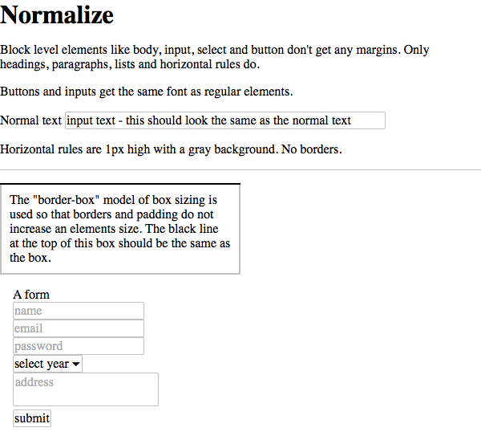

The purpose of this module is not to implement and "good looking" base to build
on top of. It's just to remove browser quirks that are rarely useful. See the
comments in `normalize.css` for specifics.

Heavily inspired by [the reset module in BASSCSS][1]

Here's what the `test.html` document looks like rendered with webkit:

[1]:https://github.com/jxnblk/basscss/blob/master/scss/_reset.scss
